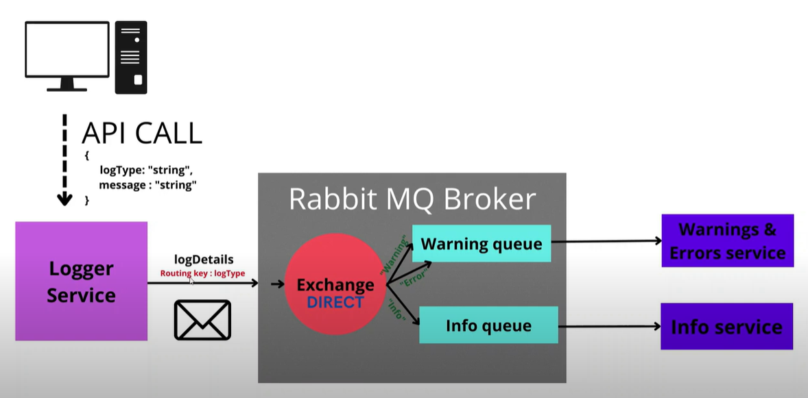

# RabbitMQ NodeJS

## Architecture

1. The client init API call to the logger service.
2. The logger service calls the rabbitMQ exchange.
3. Depending on the `Routing Key` the exchange determines which queue to send to.
4. The message gets proccessed by the service.

## Terminology

-   **Producer** is the one adding messages to the queue.
-   **Consumers** are the ones receiveing messages from the queue.
